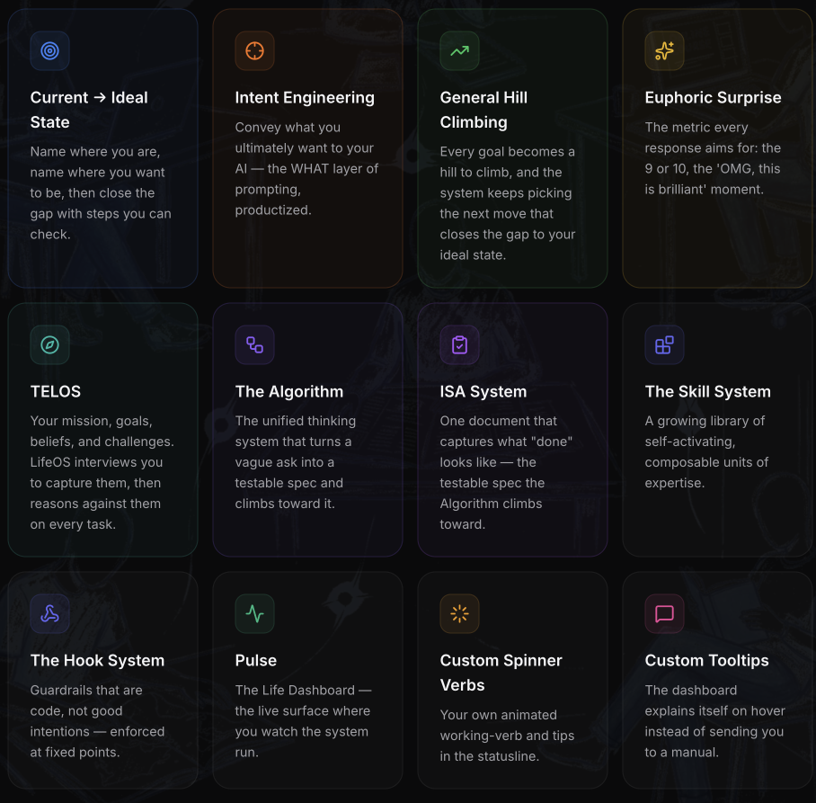

> ## 🍴 Universal AI Infrastructure (UAI)
>
> **UAI is a community fork of [Personal AI Infrastructure (PAI)](https://github.com/danielmiessler/Personal_AI_Infrastructure), created by [Daniel Miessler](https://danielmiessler.com).** The architecture, the Algorithm, Pulse, the skill and memory systems, and the overwhelming majority of the code are Daniel's work — all foundational credit belongs to him and the PAI community. This fork extends PAI toward cross-CLI feature parity (Claude Code + Codex).
>
> UAI is **not affiliated with, sponsored by, or endorsed by** Daniel Miessler. Licensed under MIT (Daniel's original copyright preserved — see [LICENSE](LICENSE)). Upstream: https://github.com/danielmiessler/Personal_AI_Infrastructure

<div align="center">

<picture>
  <source media="(prefers-color-scheme: dark)" srcset="./images/uai-logo.svg">
  <source media="(prefers-color-scheme: light)" srcset="./images/uai-logo.svg">
  
</picture>

<br/>
<br/>

# Universal AI Infrastructure (UAI)

**A fork of [Personal AI Infrastructure (PAI)](https://github.com/danielmiessler/Personal_AI_Infrastructure) by [Daniel Miessler](https://danielmiessler.com)**

[](https://github.com/jSydorowicz21/Universal-AI-Infrustructure)

<br/>

<!-- Social Proof -->


<!-- Project Health -->


<!-- Metrics -->


<!-- Content -->
[](#-installation)
[](LifeOS/)
[](LifeOS/install/LIFEOS/ALGORITHM/v8.4.0.md)
[](LifeOS/install/LIFEOS/PULSE/)
[](https://github.com/jSydorowicz21/Universal-AI-Infrustructure/graphs/contributors)

<!-- Tech Stack -->
[](https://claude.ai)
[](https://www.typescriptlang.org/)
[](https://bun.sh)
[](https://danielmiessler.com/upgrade)

<br/>

**Overview:** [What PAI Is](#what-pai-is) · [Principles](#principles) · [Features](#features)

**Get Started:** [Installation](#-installation) · [Packs](Packs/)

**Resources:** [FAQ](#-faq) · [Roadmap](#-roadmap) · [Community](#-community) · [Contributing](#-contributing)

<br/>

[](https://youtu.be/Le0DLrn7ta0)

**[Watch the full PAI walkthrough](https://youtu.be/Le0DLrn7ta0)** | **[Read: The Real Internet of Things](https://danielmiessler.com/blog/the-real-internet-of-things)**

---

</div>

## 🍴 About This Fork

**Universal AI Infrastructure (UAI)** is a community fork of **[Personal AI Infrastructure (PAI)](https://github.com/danielmiessler/Personal_AI_Infrastructure)**, originally created by **[Daniel Miessler](https://danielmiessler.com)**.

- **Original author & credit:** PAI — its architecture, the Algorithm, Pulse, the skill/memory systems, and nearly all of the code — is the work of Daniel Miessler and the PAI community. All credit for the foundation belongs to them.
- **Why this fork exists:** UAI focuses on bringing the full PAI ecosystem to feature parity across multiple agent CLIs — Claude Code, Codex, and [OMP (Oh My Pi)](LifeOS/install/LIFEOS/OMP/README.md) — so the same Life OS works behind any of them.
- **OMP harness:** fully wired via `LifeOS/install/LIFEOS/OMP/` — constitution injection, a CC-hook-protocol adapter running the real hooks against mapped OMP events, memory injection + retrieval, native safety, observability with a session-scoped `DIRECT` / `ALGO <phase> <effort>` depth indicator, slash commands, and a Claude-free-by-default, model-agnostic inference backend (`manage.ts inference default|claude|omp|auto`) so no Claude account or subscription is required and the intelligence layer runs on whatever model/auth OMP holds. **Order matters:** install LifeOS to `~/.claude` first (the adapter runs the *installed* hooks/tools, not the repo checkout's), then wire OMP from the installed tree: `~/.claude/LIFEOS/OMP/install.sh` · verify: `bun ~/.claude/LIFEOS/OMP/manage.ts status` · full docs + parity accounting: [README](LifeOS/install/LIFEOS/OMP/README.md) / [PARITY.md](LifeOS/install/LIFEOS/OMP/PARITY.md).
- **License:** MIT, unchanged. Daniel's original copyright notice is preserved in [LICENSE](LICENSE), exactly as MIT requires.
- **Not official:** UAI is an independent fork and is **not affiliated with, sponsored by, or endorsed by** Daniel Miessler. For the canonical project, see the [upstream repository](https://github.com/danielmiessler/Personal_AI_Infrastructure).

Most documentation below is inherited from upstream PAI and describes the foundation this fork extends. The current runtime and installer use the `LifeOS/` tree; inherited prose may retain the PAI name when discussing its lineage.

---

> [!IMPORTANT]
> **Current UAI runtime:** LifeOS v7.1.1, Algorithm v8.4.0, Pulse, and model-agnostic OMP integration. The historical `Releases/v5.0.0` bundle predates the current installer and does not contain the OMP integration.
>
> Install from this repository's current `LifeOS/` checkout using the [installation instructions](#-installation).

<div align="center">

# AI should magnify everyone—not just the top 1%.

</div>

## What PAI Is

PAI is a Life Operating System. It captures who you are, what you care about, and where you're trying to go — and then helps you get there using AI that knows you. Three layers stack on top of each other:

- **PAI** — the OS itself. Skills, memory, the Algorithm, your Telos, your identity files.
- **Pulse** — the Life Dashboard at `localhost:31337`. Where you actually see your state, goals, and work.
- **The DA** — your Digital Assistant. The voice and personality you talk to.

It's designed for individuals first, but the same architecture works for teams, companies, or any entity that wants to articulate what it's trying to be and move toward it.
Start with the [current-checkout installation instructions](#-installation). They support Claude Code and OMP directly, preserve the selected harness profile, and keep every mutation permissioned and additive.

## Core Components

**The unique features** — the parts you won't find anywhere else, plus the subsystems underneath. See them live and click through on **[ourlifeos.ai](https://ourlifeos.ai)**.

<a href="https://ourlifeos.ai"></a>

---

## Principles

### Humans first, tech second

PAI puts the human at the center, not the tooling. The tech exists to improve people's lives, not the other way around. Every design decision starts from one question: what does this do for the person running it?

### A Life OS, not an agent harness

PAI captures what you care about — goals, work, relationships, health, finances — and helps you pursue your ideal state across all of it. It writes code and runs agents and does the things people associate with AI tooling, but those are capabilities in service of the larger goal. The point is your life, not the tools.

### Ideal State drives everything

The biggest unsolved problem with AI is that nobody can define what "good" or "done" actually means for a given task. PAI is built around the concept of Ideal State — specifically the transition from your current state to your ideal state — and it's woven through every layer.

The primary expression is the **ISA** (Ideal State Artifact). An ISA is similar to a software PRD: it captures what done looks like so you can build toward it. The difference is that an ISA is general — it works for any creative task, from design to art to philosophy to engineering to strategy. The system decomposes the ideal state into discrete **ISCs** (Ideal State Criteria), which populate the document and double as verification items. That's how PAI hill-climbs toward ideal state on any kind of work.

### A single Digital Assistant will be everyone's interface to AI

I wrote about this in 2016 in [The Real Internet of Things](https://danielmiessler.com/blog/the-real-internet-of-things), and I'm more convinced now than I was then. The trajectory is clear: chatbots → agents → assistants. We're all building the same thing, and the endpoint is one DA per person.

TRIOT had four core ideas that PAI is built on:

- **Digital Assistants** — one DA per person, your primary interface to all AI
- **Everything gets an API** — every product, service, person, and place becomes addressable
- **Your DA dynamically creates your interfaces** — no more apps and dashboards; the DA assembles whatever you need in the moment
- **You define your ideal state, AI helps you get there** — the whole system points at your Telos

This is what PAI is reaching for.

---

## Features

### Text over opaque storage

Heavy bias toward plain text and Markdown. PAI avoids SQLite, Postgres, and other opaque stores wherever possible. Everything should be transparent and parsable — by you, by your DA, by `rg`, by anything else. If you can't read it with `cat`, we don't want it.

### Context scaffolding > model

The mistake most people make with AI is failing to feed it the big picture. PAI is fundamentally a system for handing the smartest models the right context — about you, about what you're trying to accomplish, about the tools they have — so they can actually help you reach your ideal state. The model matters less than what surrounds it.

### Bitter-pilled engineering

The flip side of context scaffolding: as models get stronger, they need fewer instructions on how to do the work. We constantly audit PAI to remove overly prescriptive direction in places where the model can do better with just the right context and tools. The system gets smaller as the models get bigger.

### Filesystem as context, no RAG

PAI has avoided RAG since June 2025. Rich text with cross-references, plus fast search like ripgrep, gives us everything people normally want from RAG — without the embedding complexity, the retrieval flakiness, or the loss of fidelity. Your filesystem is the index.

### Memory that compounds

A text-based memory system that captures what you've done, what you've learned, and what's worth keeping — and feeds it back as input to future work. Three tiers (WORK, KNOWLEDGE, LEARNING) plus a typed graph across people, companies, ideas, and research.

### Self-improvement loop

PAI captures signals about what went well and what didn't — explicit ratings, sentiment, verification outcomes, satisfaction — and uses them to improve itself. The system that runs the work is also the system that gets better at running it.

### The Algorithm

A custom algorithm that drives the current → ideal state transition through a seven-phase loop modeled on the scientific method, using Deutsch's framing of hard-to-vary explanations as the standard for "good." It's the gravitational center of PAI — every non-trivial task runs through it.

### Skills as deterministic units

A skill system biased toward deterministic code execution. The hierarchy is: code → CLI to run the code → workflows that prompt the CLI → a SKILL.md that routes between workflows. The skill is the container; SKILL.md is the front door; the actual work is real code wherever possible. Prompts wrap code; code doesn't wrap prompts.

### Thinking skills

A meaningful library of custom thinking skills — first principles, council debates, red team, root cause, systems thinking, iterative depth, aperture oscillation, and more — that the Algorithm pulls from to raise the quality of decisions across the system.

---

## 🚀 Installation

UAI installs from the current `LifeOS/` tree. The retired `Releases/v5.0.0` bundle is historical only and does not contain the OMP integration or the current installer fixes.

### Recommended: let your AI run the installer

```bash
git clone https://github.com/jSydorowicz21/Universal-AI-Infrustructure.git
cd Universal-AI-Infrustructure
```

Then tell the coding agent you want to use:

> Read `LifeOS/INSTALL.md` fully and install LifeOS from this checkout.

The guide detects the active harness and selected profile, shows every mutation before applying it, installs LifeOS Core, offers optional enhancements, and verifies the resulting runtime.

### Direct bootstrap from the checkout

The bootstrap stages the current LifeOS skill, then hands off to `/lifeos-setup` for the permissioned system integration.

**macOS / Linux**

```bash
LIFEOS_SRC="$PWD" bash LifeOS/install/install.sh
```

**Windows PowerShell**

```powershell
$env:LIFEOS_SRC = (Get-Location).Path
powershell -ExecutionPolicy Bypass -File .\LifeOS\install\install.ps1
```

Use `LIFEOS_HARNESS=omp`, `claude-code`, `codex`, `gemini`, or `opencode` when more than one installed harness makes auto-detection ambiguous. OMP setup deploys the shared LifeOS runtime and then wires the constitution and five OMP extensions through `LIFEOS/OMP/manage.ts`.

### After install

Restart the harness so its context and extensions reload. Run `/interview` to populate TELOS and identity, then open the dashboard if Pulse was selected:

```text
http://localhost:31337
```

### Updating

Pull the newer checkout and follow `LifeOS/Workflows/Update.md`. The update flow overlays managed runtime and skill files transactionally while preserving `USER`, `MEMORY`, unrelated settings, and unowned skills.

---

## 📦 PAI Packs

Packs are standalone, AI-installable capabilities you can add to any AI coding harness without installing PAI. Each pack is a self-contained prompt your DA can read and execute — point it at the pack directory and say "install this," and it handles the rest.

**[Browse all packs →](Packs/)**

---

## ❓ FAQ

### How is PAI different from just using Claude Code?

PAI is built natively on Claude Code and designed to stay that way. We chose Claude Code because its hook system, context management, and agentic architecture are the best foundation available for personal AI infrastructure.

PAI isn't a replacement for Claude Code — it's the layer on top that makes Claude Code *yours*:

- **Persistent memory** — Your DA remembers past sessions, decisions, and learnings
- **Custom skills** — Specialized capabilities for the things you do most
- **Your context** — Goals, contacts, preferences—all available without re-explaining
- **Intelligent routing** — Say "research this" and the right workflow triggers automatically
- **Self-improvement** — The system modifies itself based on what it learns

Think of it this way: Claude Code is the engine. PAI is everything else that makes it *your* car.

### What's the difference between PAI and Claude Code's built-in features?

Claude Code provides powerful primitives — hooks, slash commands, MCP servers, context files. These are individual building blocks.

PAI is the complete system built on those primitives. It connects everything together: your goals inform your skills, your skills generate memory, your memory improves future responses. PAI turns Claude Code's building blocks into a coherent personal AI platform.

### Is PAI only for Claude Code?

PAI is Claude Code native. We believe Claude Code's hook system, context management, and agentic capabilities make it the best platform for personal AI infrastructure, and PAI is designed to take full advantage of those features.

That said, PAI's concepts (skills, memory, algorithms) are universal, and the code is TypeScript and Bash — so community members are welcome to adapt it for other platforms.

### How is this different from fabric?

[Fabric](https://github.com/danielmiessler/fabric) is a collection of AI prompts (patterns) for specific tasks. It's focused on *what to ask AI*.

PAI is infrastructure for *how your DA operates*—memory, skills, routing, context, self-improvement. They're complementary. Many PAI users integrate Fabric patterns into their skills.

### What if I break something?

Recovery is straightforward:

- **Back up first** — Before any upgrade: `cp -r ~/.claude ~/.claude-backup-$(date +%Y%m%d)`
- **USER/ is safe** — Your customizations in `USER/` are never touched by the installer or upgrades
- **Settings merge, not overwrite** — The installer only updates identity and version fields; your hooks, statusline, and custom config are preserved
- **Git-backed** — Version control everything, roll back when needed
- **History is preserved** — Your DA's memory survives mistakes
- **DA can fix it** — Your DA helped build it, it can help repair it
- **Re-install** — Run the installer again; it detects existing installations and merges intelligently

---

## 🎯 Roadmap

| Feature | Description |
|---------|-------------|
| **Local Model Support** | Run PAI with local models (Ollama, llama.cpp) for privacy and cost control |
| **Granular Model Routing** | Route different tasks to different models based on complexity |
| **Remote Access** | Access your PAI from anywhere—mobile, web, other devices |
| **Outbound Phone Calling** | Voice capabilities for outbound calls |
| **External Notifications** | Robust notification system for Email, Discord, Telegram, Slack |

---

## 🌐 Community

**UAI (this fork):**

- **GitHub Discussions:** [Join the conversation](https://github.com/jSydorowicz21/Universal-AI-Infrustructure/discussions)
- **Issues:** [Report bugs or request features](https://github.com/jSydorowicz21/Universal-AI-Infrustructure/issues)

**Upstream PAI (Daniel Miessler):**

- **Discord:** PAI is discussed in the [community Discord](https://danielmiessler.com/upgrade)
- **Twitter/X:** [@danielmiessler](https://twitter.com/danielmiessler)
- **Blog:** [danielmiessler.com](https://danielmiessler.com)

### Star History

<a href="https://star-history.com/#jSydorowicz21/Universal-AI-Infrustructure&Date">
 <picture>
   <source media="(prefers-color-scheme: dark)" srcset="https://api.star-history.com/svg?repos=jSydorowicz21/Universal-AI-Infrustructure&type=Date&theme=dark" />
   <source media="(prefers-color-scheme: light)" srcset="https://api.star-history.com/svg?repos=jSydorowicz21/Universal-AI-Infrustructure&type=Date" />
   
 </picture>
</a>

---

## 🤝 Contributing

We welcome contributions! See our [GitHub Issues](https://github.com/jSydorowicz21/Universal-AI-Infrustructure/issues) for open tasks.

1. **Fork the repository**
2. **Make your changes** — Bug fixes, new skills, documentation improvements
3. **Test thoroughly** — Install in a fresh system to verify
4. **Submit a PR** with examples and testing evidence

---

## 📜 License

MIT License - see [LICENSE](LICENSE) for details.

---

## 🙏 Credits


**[Daniel Miessler](https://danielmiessler.com)** — Creator of Personal AI Infrastructure (PAI), the project this fork (UAI) is built on. The foundation, architecture, and the vast majority of the code are his work.

**Anthropic and the Claude Code team** — First and foremost. You are moving AI further and faster than anyone right now. Claude Code is the foundation that makes all of this possible.

**[IndyDevDan](https://www.youtube.com/@indydevdan)** — For great videos on meta-prompting and custom agents that have inspired parts of PAI.

### Contributors

LifeOS is built in the open, and the community's pull requests, forensic bug reports, and fresh-install writeups directly shape every release. The public repo is generated from a private source tree, so community PRs are ported into source with credit rather than merged directly — same fix, durable across releases.

<p align="center">
<a href="https://github.com/danielmiessler"></a>
<a href="https://github.com/christauff"></a>
<a href="https://github.com/kaimagnus"></a>
<a href="https://github.com/m4nt0de4"></a>
<a href="https://github.com/ksylvan"></a>
<a href="https://github.com/mvoehringer"></a>
<a href="https://github.com/sauldataman"></a>
<a href="https://github.com/sti0"></a>
<a href="https://github.com/pybe"></a>
<a href="https://github.com/fayerman-source"></a>
<a href="https://github.com/neilsoult"></a>
<a href="https://github.com/HotSauceHacker"></a>
<a href="https://github.com/salmanmkc"></a>
<a href="https://github.com/Seadubb"></a>
<a href="https://github.com/StarksLabs"></a>
<a href="https://github.com/asdf8675309"></a>
<a href="https://github.com/imrathion"></a>
<a href="https://github.com/jbmml"></a>
<a href="https://github.com/justinkatz94-glitch"></a>
<a href="https://github.com/bkolendowski"></a>
<a href="https://github.com/smolcompute"></a>
<a href="https://github.com/neilinger"></a>
<a href="https://github.com/Mutdogus"></a>
<a href="https://github.com/qozle"></a>
<a href="https://github.com/jnpkr"></a>
<a href="https://github.com/IJASolutions"></a>
<a href="https://github.com/emory"></a>
<a href="https://github.com/maxolasersquad"></a>
</p>

<sup>The 28 highest-commit contributors — [see all on the contributors graph](https://github.com/danielmiessler/LifeOS/graphs/contributors). Avatars are committers only, so the lists below carry everyone the graph can't see.</sup>

**[fayerman-source](https://github.com/fayerman-source)** — Google Cloud TTS provider integration and Linux audio support for the voice system.

**Matt Espinoza** — Extensive testing, ideas, and feedback for the PAI 2.3 release, plus roadmap contributions.

**Code contributions (merged or ported PRs):**
adamlevoy · anikinsasha · asdf8675309 · atabisz · chrisglick · christauff · HotSauceHacker · imrathion · jbmml · jnpkr · justinkatz94-glitch · ksylvan · m4nt0de4 · MarvinDontPanic · maxolasersquad · Mutdogus · neilinger · neilsoult · pybe · qozle · salmanmkc · sauldataman · Seadubb · Spirotot · StarksLabs · thatsjet

**Bug reports, fresh-install forensics, and design feedback:**
badosanjos · bnkath2o · brycemagera · catchingknives · DAESA24 · deleyva · DennisTraub · docxology · DolphusCY · donovan-sec · DonovanJonesUK · eccentricnode · fjp-veo · harryf · hjbrandt · HyggeHacker · ichoosetoaccept · infinitelyloopy-bt · JElliottMiller · jdrolls · jlacour-git · jmmarkiewicz · karlwaldman · klausagnoletti · lexilexikon · lgangitano · luccomo · MHoroszowski · michaelaye · mygirleatsmayo · nbost130 · NodarDavituri · NorthwoodsSentinel · packetsherpa · ricklesgibson · rikitikitavi2012-debug · Riskjuggler · simeonzickert · Steffen025 · stratofax · tzioup · vanvonlj · virtualian · vpzed · waveman2020-sudo · wojteksbt · xmasyx

<sup>Refreshed with each release. If your contribution is missing, open an issue — that's a bug too.</sup>

---

## 💜 Support This Project

<div align="center">

<a href="https://github.com/sponsors/danielmiessler"></a>

**PAI is free and open-source forever. If you find it valuable, you can [sponsor the project](https://github.com/sponsors/danielmiessler).**

</div>

---

## 📚 Related Reading

- [The Real Internet of Things](https://danielmiessler.com/blog/the-real-internet-of-things) — The vision behind PAI
- [AI's Predictable Path: 7 Components](https://danielmiessler.com/blog/ai-predictable-path-7-components-2024) — Visual walkthrough of where AI is heading
- [Building a Personal AI Infrastructure](https://danielmiessler.com/blog/personal-ai-infrastructure) — Full PAI walkthrough with examples

---

<details>
<summary><strong>📜 Update History</strong></summary>

<br/>

**v5.0.0 (2026-04-30) — Life Operating System**
- **Pulse** — unified daemon (port 31337): voice, hooks, observability, cron, Life Dashboard (22 routes), wiki API, optional Telegram/iMessage bridges. Replaces every previous loose service.
- **The DA** — Digital Assistant identity layer. PRINCIPAL_IDENTITY + DA_IDENTITY pair, loaded at session start. `/interview` walks you through naming your DA, picking a voice, capturing TELOS.
- **Algorithm v6.3.0** — seven-phase loop (OBSERVE → THINK → PLAN → BUILD → EXECUTE → VERIFY → LEARN). Sonnet-backed mode classifier picks MINIMAL/NATIVE/ALGORITHM and tier (E1–E5) per prompt. Closed-list thinking capabilities. Voice phase announcements. Verification doctrine (live-probe, advisor calls at commitment boundaries, cross-vendor audit at E4/E5).
- **The ISA** — Ideal State Artifact primitive. One document, twelve sections (Problem → Vision → Out of Scope → Principles → Constraints → Goal → Criteria → Test Strategy → Features → Decisions → Changelog → Verification), five identities (articulation, test harness, build verification, done condition, system of record). Owned by the **ISA skill** (Scaffold, Interview, CheckCompleteness, Reconcile, Seed, Append) with a dozen reference examples spanning E1–E5.
- **Containment + release tooling** — privacy is structural. `containment-zones.ts` declares every directory's privacy zone; `ContainmentGuard` PreToolUse hook blocks cross-zone leaks; 12 security gates run on every public release; two-stage release (stage → publish) never auto-chains.
- **Memory v7.6** — structured by purpose: WORK (active task ISAs), KNOWLEDGE (typed graph: People, Companies, Ideas, Research, Blogs), LEARNING (meta-patterns), RELATIONSHIP (DA-Principal notes), OBSERVABILITY (every tool call + hook firing + satisfaction signal), STATE (session registry).
- **45 public skills, 171 workflows, 37 hooks** — skills are self-activating composable domain units; hooks fire across SessionStart, UserPromptSubmit, PreToolUse, PostToolUse, Stop, SubagentStop, PreCompact, SessionEnd.
- **Historical installer** — retired; current installations use the repository's `LifeOS/` checkout and the instructions above.
- [Archived v5.0.0 release notes](https://github.com/jSydorowicz21/Universal-AI-Infrustructure/tree/68f501b23b2fc240331ffd698236c3bf8a50b57a/Releases/v5.0.0/README.md)

**v4.0.3 (2026-03-01) — Community PR Patch**
- JSON array parsing fix in Inference.ts
- 29 dead references removed from CONTEXT_ROUTING.md
- WorldThreatModelHarness PAI_DIR portability
- User context migration for v2.5/v3.0 upgraders
- [Release Notes](https://github.com/jSydorowicz21/Universal-AI-Infrustructure/tree/68f501b23b2fc240331ffd698236c3bf8a50b57a/Releases/v4.0.3/README.md)

**v4.0.2 (2026-03-01) — Bug Fix Patch**
- 13 surgical fixes: Linux compatibility, installer, statusline, hooks
- Cross-platform OAuth token extraction, GNU coreutils tr fix
- Inference guard (~15s savings), lineage tracking, dead code removal
- [Release Notes](https://github.com/jSydorowicz21/Universal-AI-Infrustructure/tree/68f501b23b2fc240331ffd698236c3bf8a50b57a/Releases/v4.0.2/README.md)

**v4.0.1 (2026-02-28) — Upgrade Path & Preferences**
- Upgrade documentation with backup, merge, and post-upgrade checklist
- Configurable temperature unit (Fahrenheit/Celsius) in statusline and installer
- FAQ fixes: removed stale Python reference, improved recovery guidance
- [Release Notes](https://github.com/jSydorowicz21/Universal-AI-Infrustructure/tree/68f501b23b2fc240331ffd698236c3bf8a50b57a/Releases/v4.0.1/README.md)

**v4.0.0 (2026-02-27) — Lean and Mean**
- 38 flat skill directories → 12 hierarchical categories (-68% top-level dirs)
- Dead systems removed: Components/, DocRebuild, RebuildSkill
- CLAUDE.md template system with BuildCLAUDE.ts + SessionStart hook
- Algorithm v3.5.0 (up from v1.4.0)
- Comprehensive security sanitization (33+ files cleaned)
- All version refs updated, Electron crash fix
- 63 skills, 21 hooks, 180 workflows, 14 agents
- [Release Notes](https://github.com/jSydorowicz21/Universal-AI-Infrustructure/tree/68f501b23b2fc240331ffd698236c3bf8a50b57a/Releases/v4.0.0/README.md)

**v3.0.0 (2026-02-15) — The Algorithm Matures**
- Algorithm v1.4.0 with constraint extraction and build drift prevention
- Persistent PRDs and parallel loop execution
- Full installer with GUI wizard
- 10 new skills, agent teams/swarm, voice personality system
- 38 skills, 20 hooks, 162 workflows
- [Release Notes](https://github.com/jSydorowicz21/Universal-AI-Infrustructure/tree/68f501b23b2fc240331ffd698236c3bf8a50b57a/Releases/v3.0/README.md)

**v2.5.0 (2026-01-30) — Think Deeper, Execute Faster**
- Two-Pass Capability Selection: Hook hints validated against ISC in THINK phase
- Thinking Tools with Justify-Exclusion: Opt-OUT, not opt-IN for Council, RedTeam, FirstPrinciples, etc.
- Parallel-by-Default Execution: Independent tasks run concurrently via parallel agent spawning
- 28 skills, 17 hooks, 356 workflows
- [Release Notes](https://github.com/jSydorowicz21/Universal-AI-Infrustructure/tree/68f501b23b2fc240331ffd698236c3bf8a50b57a/Releases/v2.5/README.md)

**v2.4.0 (2026-01-23) — The Algorithm**
- Universal problem-solving system with ISC (Ideal State Criteria) tracking
- 29 skills, 15 hooks, 331 workflows
- Euphoric Surprise as the outcome metric
- Enhanced security with AllowList enforcement
- [Release Notes](https://github.com/jSydorowicz21/Universal-AI-Infrustructure/tree/68f501b23b2fc240331ffd698236c3bf8a50b57a/Releases/v2.4/README.md)

**v2.3.0 (2026-01-15) — Full Releases Return**
- Complete `.claude/` directory releases with continuous learning
- Explicit and implicit rating capture
- Enhanced hook system with 14 production hooks
- Status line with learning signal display
- [Release Notes](https://github.com/jSydorowicz21/Universal-AI-Infrustructure/tree/68f501b23b2fc240331ffd698236c3bf8a50b57a/Releases/v2.3/README.md)

**v2.1.1 (2026-01-09) — MEMORY System Migration**
- History system merged into core as MEMORY System

**v2.1.0 (2025-12-31) — Modular Architecture**
- Source code in real files instead of embedded markdown

**v2.0.0 (2025-12-28) — PAI v2 Launch**
- Modular architecture with independent skills
- Claude Code native design

</details>

---

<div align="center">

**Built with ❤️ by [Daniel Miessler](https://danielmiessler.com) and the PAI community**

*Universal AI Infrastructure (UAI) is a fork maintained by [jSydorowicz21](https://github.com/jSydorowicz21) — all foundational credit to Daniel Miessler.*

*Augment yourself.*

</div>
