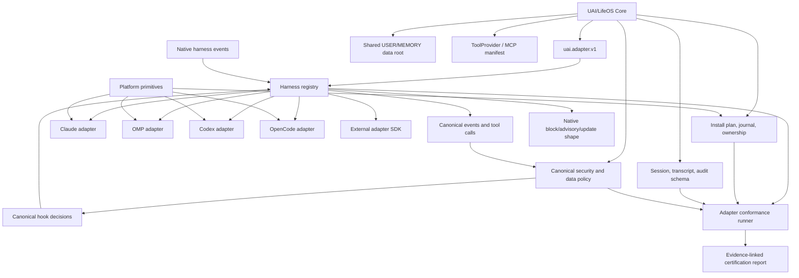
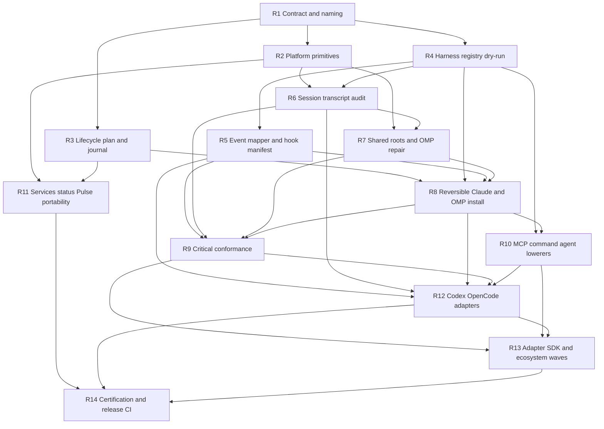

# UAI Universal Runtime Roadmap

> - Branch: `feat/universal-uai-implementation`
> - Baseline: PR #1 head `9a2cba4f`
> - Updated: 2026-07-16
> - Status: implemented additive kernel and current LifeOS/OMP integration; C3 and hosted cross-OS execution evidence remain unavailable

## Objective

Make UAI/LifeOS portable across operating systems and coding-agent CLIs without forking LifeOS business logic or overstating parity.

“Universal” means:

1. A versioned adapter contract.
2. Explicit capability negotiation.
3. Observable certification evidence.
4. Shared durable identity and data across harnesses.
5. One canonical security and data-classification policy.
6. Additive, reversible, journaled installation.
7. Fail-visible critical controls.
8. Honest degradation where a platform or harness lacks a primitive.
9. An adapter SDK that lets future CLIs integrate without changing core policy.

It does **not** mean identical behavior on unknown future APIs, identical prompt authority in every CLI, or “full parity” inferred from configuration files.

## Implementation outcome

The branch now implements R1–R14 as an additive universal kernel plus current
LifeOS/OMP integration. Root resolution, lifecycle planning/apply/recovery/uninstall,
config merging, hook load probes, certification, reporting, bootstrap trust,
command policy, transcript provenance, redaction, reviewer cadence/locks, and
fail-visible degradation have isolated negative controls.

OMP remains `C0` and reports wiring/loadability separately from observation.
Fixture or copied-file evidence cannot earn C3; no repository-owned trusted
staged/live executor exists. The checked-in workflow defines blocking Windows,
macOS, and Linux jobs, and its checked-in probes ran locally under Bash and
PowerShell on Windows. Hosted macOS/Linux runner execution was not observed.

## Baseline audit record

The following audit findings describe the pre-repair PR #1 baseline, not the
current implementation. They remain here as rationale and traceability.

### What the baseline audit found

Five parallel audits and three adversarial reviews converged on the same root problem: the repository has useful portability work, but it is split across incompatible generations.

### Existing portability strata

1. **Current bare-skill installer**
   - `LifeOS/Tools/InstallEngine.ts` detects a small harness union and remains Claude-shaped.
   - It excludes Codex and OMP as first-class harnesses.
   - It uses POSIX `command -v` and several tools use `process.env.HOME || ""`.

2. **Retained Codex/OpenCode layer**
   - `LifeOS/install/PAI/PAI-Install/engine/frameworks.ts` already models Claude, Codex, OpenCode, config roots, instruction files, and shared `~/.pai` data.
   - `LifeOS/install/hooks/FrameworkHookAdapter.ts` and `framework-hook-contract.ts` contain reusable normalization and block-emission knowledge.
   - `LifeOS/install/plugins/pai-opencode.ts` contains a real OpenCode event bridge.
   - This code is valuable source material, not current certified support.

3. **Current OMP layer**
   - `LifeOS/install/LIFEOS/OMP/**` proves a second harness can run canonical hooks through an adapter and native hot-path extensions.
   - It is structurally separate from the retained framework registry.
   - It currently hardcodes shared session IDs and `~/.claude` roots, omits universal egress certification, and reports wiring rather than observed enforcement.

4. **Platform-specific runtime fragments**
   - Pulse has macOS/Linux/Windows management pieces.
   - `Services.ts` is still launchd/Claude-root bound.
   - The rich statusline is Bash/jq/POSIX based.
   - Windows update scripts contain useful junction/reparse and command-resolution patterns, but the Windows bootstrap is stale PAI v5.

5. **Lifecycle documentation without lifecycle machinery**
   - Update and uninstall workflows describe desirable ownership semantics.
   - No current LifeOS ownership manifest or transactional executor implements them.
   - Backups are local and inconsistent.

### High-confidence gaps

| Area | Confirmed gap | Representative evidence |
|---|---|---|
| Harness detection | Current harness union excludes Codex/OMP and defaults clean machines to Claude | `LifeOS/Tools/InstallEngine.ts:37-150` |
| Windows detection | Tool lookup uses POSIX `command -v` | `LifeOS/Tools/InstallEngine.ts:80-109` |
| Windows paths | Setup tools repeatedly depend on `HOME`; native Windows commonly supplies `USERPROFILE` | `LifeOS/Tools/InstallHooks.ts:29-31`, `DeployComponents.ts:388-389` |
| Shared state | OMP extensions default USER/MEMORY/observability to `~/.claude/LIFEOS` | `OMP/extensions/lifeos-memory/index.ts:42-48`, `lifeos-observability/index.ts:39-44` |
| Session identity | OMP persists `session_id: "omp"`; generic adapter uses `pai-framework-session` fallback | `lifeos-hooks/index.ts:352-356`, `FrameworkHookAdapter.ts:359-365` |
| Transcript provenance | OMP parsing exists, but reusable transcript union and roots omit OMP | `TOOLS/lib/transcripts.ts:4-23`, `TranscriptParser.ts:78-103` |
| Safety truth | Doctor/OMP status prove wiring, not that a negative control fired and blocked | `TOOLS/Doctor.ts:14-20,345-346`, `OMP/manage.ts:167-174` |
| Egress | OMP safety reuses command/injection classifiers but not canonical route ceilings | `OMP/PARITY.md:86-97`, `OMP/extensions/lifeos-safety/index.ts:79-91` |
| Config safety | Invalid `settings.json` can become `{}`; settings are written before hooks finish copying | `LifeOS/Tools/InstallHooks.ts:73-101` |
| Dependencies | Existing `package.json` can cause required LifeOS dependencies to be skipped | `LifeOS/Tools/DeployCore.ts:135-161` |
| USER linking | Initial setup assumes symbolic links; Windows needs a junction policy | `LifeOS/Tools/InstallEngine.ts:481-558` |
| Installer lifecycle | No central plan, journal, ownership manifest, rollback, or deterministic uninstall | `LifeOS/Workflows/Update.md`, `Uninstall.md`, local backup implementations |
| Services | Service control is launchd/`~/.claude` bound | `LIFEOS/TOOLS/Services.ts:18-23,114-129` |
| Distribution | Unix installer silently falls back to old v7.0.0; Windows installer expects PAI v5 wizard | `LifeOS/install/install.sh:25-42`, `install.ps1:1-8,69-86` |
| CI | Current matrix is non-blocking and validates the pre-LifeOS layout | `.github/workflows/pai-codex-validation.yml:9-45` |

## Design decisions

### Naming

- **UAI** names the public adapter, capability, certification, and interoperability contracts.
- **LifeOS** remains the runtime/product.
- **PAI** remains a compatibility namespace for existing environment variables and durable data until a separate, explicit migration exists.
- Keep `~/.pai` as the default durable data root for now. `UAI_DATA_DIR` is an alias/override. Do not introduce a default `~/.uai` move inside this roadmap.

### Three separate support axes

Every public support statement must show all three axes:

1. **Platform tier** — what the OS/runtime environment can run.
2. **Adapter class** — how UAI integrates with the harness.
3. **Certification level** — what observable contract passed.

“Supported on Windows” and “C3 security-certified in OMP” are different claims.

### Capability states

Use these exact states:

- `unsupported` — the harness/platform exposes no usable primitive.
- `detected` — CLI/root/version discovered without writes.
- `installed` — UAI-owned files/config entries exist.
- `wired` — a native event reaches the adapter handler.
- `active` — a same-version negative probe observed the expected block, taint, or audit record.
- `degraded` — usable with explicit losses.
- `failed` — expected capability cannot execute.
- `declined` — optional capability intentionally disabled by the user.

Configuration presence is never evidence for `active`.

## Target architecture

### Core owns

- Versioned adapter/capability/certification types.
- Canonical event, tool call/result, hook result, session, transcript, and audit shapes.
- Shared USER/MEMORY root and profile isolation rules.
- Security classifiers, trust zones, external-content taint, and provider route policy.
- Lifecycle transaction semantics: plan, snapshot, journal, ownership, rollback, uninstall.
- ToolProvider/MCP intent and policy.
- Conformance fixtures and report semantics.

### Platform layer owns

Only OS primitives:

- Home, config, data, runtime, cache, and temp paths.
- Environment expansion.
- Executable lookup and spawn wrapping.
- POSIX/PowerShell command rendering.
- Symlink/junction/copy-degraded link semantics.
- Service backends: launchd, systemd-user, Windows Scheduled Task, foreground/unsupported.
- Notification/audio capability facts.

It does not know LifeOS security policy, memory schemas, or harness event semantics.

### Harness adapter owns

- CLI/config-root discovery and confidence.
- Instruction/system-prompt/context-file lowering with authority/loss metadata.
- Config format and additive mutation candidates.
- Native event and tool mapping.
- Native block/advisory/update result emission.
- Transcript roots and native line parsing.
- Command, agent, prompt, MCP, model/reasoning, and launch-spec lowering.
- Harness-specific doctor/conformance probes.

It does not own install transactions, durable identity, security policy, or memory business logic.

### MCP’s role

MCP is the portable tool/data/workflow plane. It does not replace UAI’s session, transcript, lifecycle, identity, security, or certification contracts.

## Platform tiers

| Tier | Environment | Core claim | Explicit exclusions until proven |
|---|---|---|---|
| P1 | macOS desktop | Installer, shared state, hooks, Pulse/service, rich statusline where dependencies exist | No claim beyond executable evidence for optional desktop integrations |
| P2 | Linux desktop/headless and WSL-as-Linux | Core runtime, hooks, foreground Pulse; systemd-user where available | No guaranteed audio/toast; no launchd assumptions; WSL GUI is separate evidence |
| P3 | Native Windows core | Bun/PowerShell installer, junction-backed shared state, Windows hook commands, foreground/scheduled Pulse when proven | No desktop voice/toast claim; no POSIX shell dependency on the critical path |
| P4 | SSH/container/headless | Core non-GUI runtime, isolated roots, foreground/no-autostart operation | No GUI, audio, desktop notification, or service-manager guarantee |
| P5 | Future/unknown harness | Discovery and extension contract only | No support claim until adapter probes exist |

## Adapter classes

| Class | Meaning |
|---|---|
| Native | Public hook/plugin/event surface can lower UAI lifecycle and policy directly |
| Compatibility | Instructions/tools/headless/transcripts work, but one or more native lifecycle/security surfaces are missing or weaker |
| Wrapper/proxy | UAI controls process launch, temp roots, environment, and output parsing; native lifecycle enforcement is unavailable |
| Discovery-only | UAI can identify the CLI and roots but does not mutate or claim runtime governance |
| Unsupported | No safe/stable public integration path is available |

Wrappers may earn `C2-W`, never native `C3`, unless the wrapper owns every tool execution/egress path and proves the same negative controls.

## Certification levels

| Level | Required observed contract |
|---|---|
| C0 — Discovery | Read-only CLI/version/root/config-shape detection; secrets redacted |
| C1 — Reversible bootstrap | Additive instruction/context installation; sentinel proves loading; uninstall restores bytes or removes only UAI-owned entries |
| C2 — Tool/headless interoperability | Fake MCP/tool registration or equivalent; headless run; transcript with loss metadata; model/provider recorded or explicitly unavailable |
| C3 — Critical controls | Unique session identity, profile/root isolation, lifecycle blocking, SYSTEM/USER boundary, provider egress ceiling, external-content taint, fail-visible audit evidence |
| C4 — Session portability | Stable IDs and transcript provenance; session event/export/import support with tool calls, approvals, file changes, timing, malformed-line accounting |
| C5 — Packaged adapter | Native/plugin packaging where available; versioned capabilities; update/rollback/uninstall conformance; evidence across declared OS tiers |

A trusted always-on LifeOS claim requires C3 or higher. C2 is usable compatibility, not security equivalence.

## Universal invariants

Every C3+ adapter must preserve:

1. Stable unique `uai_session_id` plus native session ID where available.
2. Profile/root binding and transcript URI or explicit fallback reason.
3. Shared USER/MEMORY through the canonical data-root resolver.
4. No cross-profile reads/writes unless explicitly linked.
5. Atomic critical JSON state; append/lock policy for multiwriter logs.
6. Single-sourced trust zones and safety/data classifiers.
7. External-content taint with tool/source provenance.
8. Explicit fail mode for every critical control.
9. Fail-open may continue the turn only when it records visible degraded/failed state.
10. Provider route, model/vendor, locality, retention evidence, and maximum data class.
11. Bounded non-secret audit records for critical decisions.
12. Additive install and manifest-keyed uninstall; USER retained by default.
13. No config reported active unless the harness actually reads and executes it.
14. No harness-specific fork of policy or memory business logic.

## Dependency graph

## Work packages

Each package is intended to fit one PR. A fresh agent should be able to execute it from this section plus the referenced files.

### R1 — Unified UAI adapter contract and naming

**Branch:** `universal/01-adapter-contract`

**Scope**

- Add one `uai.adapter.v1` contract package.
- Define adapter IDs, platform facts, capability states, fail modes, evidence references, certification levels, canonical events/tools/results/session/transcript entries, and lifecycle operation references.
- Document naming: UAI public contracts, LifeOS runtime, PAI compatibility namespace.
- Preserve `~/.pai` as the default data root.

**Do not**

- Wire production adapters.
- Add separate security, lifecycle, instruction, and transcript manifests that duplicate the same facts.
- Add fields with no acceptance probe.

**Acceptance**

- TypeScript and JSON-schema fixtures validate Claude, OMP, Codex, OpenCode, and unknown examples.
- A critical capability cannot be `active` without adapter version, probe ID, timestamp, and evidence URI.
- Unsupported fields default absent/false.
- Contract package imports no harness implementation.

**Rollback**

Delete the additive contract package; no runtime behavior changes.

### R2 — Shared roots and platform primitives

**Branch:** `universal/02-platform-primitives`

**Depends on:** R1

**Scope**

- Promote the portable behavior in `LIFEOS/TOOLS/lib/paths.ts` into the shared source of truth.
- Add boring primitives for `homeDir`, `expandHome`, `tmpDir`, executable lookup/spawn, hook command rendering, and directory links.
- Use `HOME`, then `USERPROFILE`, then `homedir()`.
- Replace POSIX `command -v` detection with `Bun.which()`/PATHEXT-aware behavior.
- Windows directory links default to junction; POSIX uses symlink.
- Render explicit POSIX and Windows hook commands; shell-only hooks are declared POSIX-only until ported.

**Target files**

- `LifeOS/Tools/InstallEngine.ts`
- `LifeOS/Tools/{InstallSettings,InstallHooks,DeployComponents,ActivateImports,ScaffoldUser,LinkUser,SeedPulse}.ts`
- `LifeOS/install/hooks/lib/paths.ts`
- `LifeOS/install/LIFEOS/TOOLS/lib/paths.ts`
- Installed hook manifest generation/fixtures

**Acceptance**

- Temp-env tests cover `HOME` unset with `USERPROFILE`, backslashes, `${HOME}`, `$HOME`, explicit UAI/PAI roots, and stale framework env.
- Fake `bun.cmd` and CLI `.cmd` executables resolve and receive exact arguments on Windows.
- Windows junction and macOS/Linux symlink tests preserve shared USER data.
- No unqualified `process.env.HOME || ""` remains in setup tools without documented reason.
- No critical installed command depends on implicit Bash under native Windows.

**Rollback**

Adapters remain additive; existing aliases stay temporarily available.

### R3 — Lifecycle planner, mutation journal, and ownership baseline

**Branch:** `universal/03-lifecycle-foundation`

**Depends on:** R1

**Scope**

- Add read-only `InstallPlan` generation.
- Define `Mutation`, `JournalEntry`, `OwnershipManifest`, `OwnedArtifact`, `AdoptedArtifact`, `BackupRef`, and `Gate`.
- Ownership classes: `owned`, `adopted`, `foreign`, `user-data`, `unknown`.
- Wrap low-risk file mutations first.
- Shared config parse failure is a blocker.
- Write journal state before/after each mutation; snapshot existing bytes before writes.

**Acceptance**

- Plans for empty Claude root, customized settings, existing private USER root, and OMP profile list exact mutations and perform zero writes.
- Wrapped file operations can restore prior bytes in temp roots.
- Invalid JSON/YAML/TOML remains byte-identical and exits non-zero.
- First migration marks uncertain historical files `adopted`/`unknown`, never falsely `owned`.

**Rollback**

Manifests are inert data if code is reverted; wrapped mutations retain backups.

### R4 — Harness registry and discovery-only adapters

**Branch:** `universal/04-harness-registry`

**Depends on:** R1, R2

**Scope**

- Replace the current harness union with a registry.
- Seed from retained `frameworks.ts` and current OMP discovery.
- Register Claude Code, OMP, Codex, OpenCode, and `external:<id>`.
- Explicit user/env selection outranks binary/config leftovers.
- Preserve or version current `DetectEnv` output.
- Emit dry-run mutation candidates only.

**Acceptance**

- Env-only, binary-only, config-only, profile, and clean-machine fixtures pass.
- Codex and OMP are representable.
- A clean machine does not silently become a certified Claude install.
- Unknown adapters remain C0/discovery-only.
- No production config writes originate from this PR.

### R5 — Canonical event mapper and hook manifest

**Branch:** `universal/05-event-kernel`

**Depends on:** R1, R4

**Scope**

- Define one lifecycle event enum and hook manifest.
- Normalize native events into canonical prompt/tool/session shapes.
- Translate canonical hook decisions back into native block/advisory/update forms.
- Lift mapping knowledge from `FrameworkHookAdapter.ts`, OMP extensions, and OpenCode plugin.
- Encode per-hook requirements: event, matcher, blocking/advisory, timeout, Pulse gate, native-port preference, fail mode.

**Acceptance**

- Claude, Codex, OpenCode, and OMP pre-tool fixtures normalize to the same canonical tool call.
- Block emitters prove Claude exit-2, Codex/OpenCode JSON/trust-aware handling, and OMP native block behavior.
- Additional-context and tool-result taint fixtures round-trip.
- Generated Claude manifest matches current behavior modulo approved order/format.
- Missing event surfaces produce degradation records, not silent omission.

### R6 — Session identity, transcript provenance, and audit schema

**Branch:** `universal/06-session-transcript-audit`

**Depends on:** R1, R2, R4

**Scope**

- Generate stable unique `uai_session_id` per session/profile/root.
- Preserve native harness session ID where available.
- Merge reusable transcript roots/parsers and add OMP as a first-class source.
- Record transcript URI, parser/version, source line/event IDs, and fallback reason.
- Define bounded redacted audit rows.
- Extract MemoryWriter-style atomic state primitives for critical manifests.

**Acceptance**

- Two concurrent fake OMP sessions produce distinct IDs and separate rows.
- No persisted `session_id: "omp"` or `pai-framework-session` remains outside migration fixtures.
- Claude, Codex `response_item`, OpenCode message, and OMP nested-message fixtures parse.
- Malformed lines produce counts/warnings rather than silent loss.
- Interrupted critical JSON writes leave old or new valid JSON, never truncation.

### R7 — Shared data roots and OMP truth repair

**Branch:** `universal/07-omp-repair`

**Depends on:** R2, R5, R6

**Scope**

- Move OMP hooks, memory, observability, safety, reviewer/session discovery, and inference override paths to canonical roots.
- Bind each event to the canonical session/provenance contract.
- Declare grant, rewrite, elicitation, and egress limitations explicitly.
- Wire provider route ceilings where the harness path can enforce them; otherwise mark unsupported/failed.
- Change status language from presence-based “active” to installed/wired/active states.
- Preserve OMP native hot-path performance by importing canonical classifiers, not copying them.

**Acceptance**

- Two temp profiles/data roots cannot cross-read or cross-write.
- No OMP USER/MEMORY default implicitly points at `~/.claude`.
- Dangerous command blocks; benign command passes; external result receives taint/provenance.
- Missing classifier/hook runner marks critical control failed/degraded.
- Egress route ceiling is `active`, `unsupported`, or `failed`; never hidden inside generic “safety active.”

### R8 — Reversible Claude and OMP install/apply/uninstall

**Branch:** `universal/08-reversible-install`

**Depends on:** R3, R4, R5, R7

**Scope**

- Route Claude and OMP apply paths through the lifecycle executor.
- Stage hook scripts before committing config references.
- Merge required dependencies into existing manifests or produce a blocker.
- Journal OMP `config.yml` entries and `APPEND_SYSTEM.md` ownership.
- Implement manifest-keyed uninstall; retain USER by default.
- Modernize or explicitly refuse stale Windows/Unix bootstrap paths; no silent release downgrade.

**Acceptance**

- Invalid settings/config remains unchanged.
- Injected copy failure leaves no config reference to missing hooks.
- Existing `package.json` without `yaml` is safely merged or blocked.
- OMP uninstall removes only UAI entries and restores pre-existing append-system bytes/link.
- Foreign config keys/extensions survive.
- Failed apply rolls back every file for which rollback is claimed.
- No rollback promise is made for services or `node_modules` until their undo is implemented.

### R9 — Critical-control conformance and Doctor integration

**Branch:** `universal/09-adapter-conformance`

**Depends on:** R5, R6, R7, R8

**Scope**

- Build deterministic `AdapterConformance` using fake harnesses, temp roots, and negative controls.
- Keep Doctor as advisory health; consume conformance artifacts for `active` certification.
- Separate provider policy/terms evidence from live connectivity.
- Emit non-secret audit evidence.

**Required probes**

- Instruction sentinel.
- Forbidden command block and benign allow.
- SYSTEM write block and equivalent USER write allow.
- Missing hook target/runner.
- External Web/MCP/mail/drive/calendar taint with source provenance.
- Provider egress route ceiling; unknown route is PUBLIC/blocked.
- Two-session collision and transcript provenance.
- Two-profile root isolation.
- Invalid config and interrupted state write.
- Install/uninstall preservation.

**Acceptance**

- Doctor never prints critical `active` without same-version evidence.
- C3 does not require real API keys.
- Live auth probes use non-sensitive sentinels and prove connectivity only.
- External-content claim says taint marker present, not “injection prevented.”
- Wrapper/proxy fixtures cannot earn native C3.

### R10 — MCP/tool plane and command/agent/prompt lowerers

**Branch:** `universal/10-capability-lowerers`

**Depends on:** R4, R8

**Scope**

- Add a canonical ToolProvider/MCP manifest with auth/env/tool-filter/approval/sandbox policy.
- Add canonical command and agent intent only for capabilities already shared by two adapters.
- Lower to Claude, OMP, Codex, and OpenCode config/extension surfaces.
- Record lossy mappings explicitly.

**Acceptance**

- Fake MCP `uai_echo` registers and executes where C2 is claimed.
- MCP environment is allowlisted; secret values never appear in logs.
- `/interview` and harness-specific equivalents map to one intent fixture.
- Unsupported approvals, model/reasoning knobs, and tool filters are recorded as losses.
- MCP is not used as evidence for lifecycle/session parity.

### R11 — Platform service, statusline, Pulse, and optional desktop minimum

**Branch:** `universal/11-platform-runtime`

**Depends on:** R2, R3

**Scope**

- Introduce a narrow service backend for launchd, systemd-user, Windows Scheduled Task, foreground, and unsupported.
- Make `Services.ts` the registry; platform backends own mechanics.
- Add a Bun/TypeScript minimal statusline fallback for Windows/headless.
- Move Pulse modules away from implicit `~/.claude` paths.
- Treat audio/toast/voice as capability-negotiated optional features.

**Acceptance**

- Service status/dry-run returns foreground/unsupported rather than throwing on unavailable managers.
- Foreground Pulse health passes in Linux and Windows temp profiles.
- Windows statusline exits 0 with `HOME` unset and `USERPROFILE` set.
- Rich POSIX statusline remains available but missing jq/shell helpers cannot block the core runtime.
- No Windows voice/toast claim without executable smoke evidence.

### R12 — Codex and OpenCode first-party adapters

**Branch:** `universal/12-codex-opencode-adapters`

**Depends on:** R5, R6, R8, R9, R10

**Scope**

- Port retained registry, hook adapter, path, transcript, OpenCode plugin, and framework launch knowledge into the new contract.
- Treat legacy parity docs as source material only.
- Codex hook support requires trusted/managed hook setup and versioned probes.
- Certify each adapter only to the level its current public and observed API earns.

**Acceptance**

- C0 discovery works without auth.
- C1 install writes only files/config the current harness reads; uninstall restores bytes.
- C2 fake MCP/headless transcript passes where supported.
- Codex C3 is refused unless hook trust/enablement and negative controls pass.
- OpenCode C3 is refused unless plugin/event blocking and failure behavior pass.
- Support reports include CLI version, OS tier, adapter version, evidence ID, last verified date, and losses.

### R13 — Adapter SDK and ecosystem expansion waves

**Branch:** `universal/13-adapter-sdk`

**Depends on:** R9, R10, R12

**Scope**

- Publish an adapter template, capability probe kit, fixture pack, install mutation provider API, conformance runner integration, and certification report format.
- Unknown CLIs start discovery-only.
- Each new CLI is its own PR; never batch unrelated adapters into one implementation PR.

**Acceptance**

- A synthetic `external:test` adapter reaches C0 and C1 without core changes.
- Unsupported capabilities default absent/false.
- Template includes config-root discovery, root/profile isolation, instruction sentinel, uninstall, transcript losses, hook fail mode, MCP env scrub, and evidence output.
- Adding an optional capability remains backward-compatible with old fixtures.

**Independent follow-on PR queue**

| Priority | Adapter | Initial target | Known constraint |
|---|---|---|---|
| A | Goose | Native candidate, C0→C3 | Verify current hook blocking and plugin packaging |
| A | Hermes | Native candidate, C0→C3 | Verify hook/terminal backend/session contracts |
| A | OpenClaw | Native gateway candidate, C0→C4 | Separate gateway, channel, and provider-locality evidence |
| B | Cursor local CLI | Compatibility/native candidate, C0→C3 | Hooks differ for local/cloud/enterprise; certify separately |
| B | Cline CLI | Compatibility/native candidate, C0→C3 | Verify plugin/hook blocking and ACP/headless transcripts |
| B | Gemini/Antigravity | Volatility-gated, C0→C2/3 | Product transition requires version-specific probes |
| B | GitHub Copilot CLI | Compatibility candidate, C0→C2/3 | Verify hook blocking, session export, enterprise policy |
| C | Continue CLI | Compatibility candidate, C0→C2 | No comparable lifecycle blocking found; do not overclaim |
| C | Aider | Wrapper/proxy C2-W | No native lifecycle hooks; process/environment guarantees only |

Every row remains C0 research until its repo-owned evidence exists.

### R14 — Generated overlays, certification reports, and release conformance

**Branch:** `universal/14-release-truth`

**Depends on:** R9, R11, R12, R13

**Scope**

- Generate harness prompt overlays from canonical `LIFEOS_SYSTEM_PROMPT.md` plus small adapter-specific overlays/capability notices.
- Generate the support matrix from evidence artifacts.
- Replace or clearly retire old pre-LifeOS validation.
- Add blocking current-layout fixture CI on Windows, macOS, and Linux.
- Keep live vendor CLI probes opt-in unless an adapter-specific release job has credentials and stable terms.

**Acceptance**

- Prompt drift test fails when canonical security/privacy/verification doctrine changes without regenerated output.
- Report prints platform tier × adapter class × certification level.
- Every badge/claim links adapter version, CLI version, OS/profile, evidence artifact, source docs, last-verified date, and degraded features.
- Current-layout fixture CI is required for relevant paths on Windows/macOS/Linux.
- WSL/container/headless profiles run as deterministic fixtures or dedicated jobs.
- No `full`, `native`, `active`, `enforced`, `parity`, or `supported` claim exists without its defined evidence.

## Parallel execution waves

### Wave A — Kernel and facts

1. R1 first.
2. R2, R3, and R4 can proceed in parallel after R1.

**Gate:** No new support claim; only contracts, discovery, platform primitives, and lifecycle planning.

### Wave B — Runtime normalization

- R5 and R6 can proceed in parallel after their dependencies.
- R7 follows their root/session/event contracts.
- R11 can proceed independently from R5-R10 after R2/R3.

**Gate:** No adapter applies config unless it uses canonical roots, unique sessions, and declared event semantics.

### Wave C — Safe apply and proof

- R8 introduces reversible Claude/OMP apply.
- R9 certifies critical controls.
- R10 builds reusable capability lowerers.

**Gate:** No `active` critical-control state without observed probes. No production mutation without journal/ownership.

### Wave D — First-party expansion

- R12 ports Codex/OpenCode through the proven kernel.
- R13 publishes the SDK and launches independent adapter PRs.

**Gate:** Each adapter earns only the exact level its evidence proves.

### Wave E — Release truth

- R14 generates overlays, reports, and blocking current-layout CI.

**Gate:** Public claims are derived from evidence, not hand-maintained tables.

## Proof matrix

| Contract | Static fixture | Fake CLI/temp root | Opt-in live | Required public evidence |
|---|---:|---:|---:|---:|
| CLI/root discovery | Yes | Yes | Optional | C0 |
| Instruction loading | Generated file snapshot | Sentinel run | Recommended | C1 |
| Byte-preserving uninstall | Plan snapshot | Required | Optional | C1 |
| MCP/tool interop | Config fixture | Fake MCP required | Optional | C2 |
| Headless transcript | Parser fixture | Required | Recommended | C2 |
| Lifecycle blocking | Canonical event fixture | Negative control required | Adapter release probe | C3 |
| Session identity/concurrency | Schema fixture | Two sessions required | Optional | C3 prerequisite |
| Profile/root isolation | Path fixture | Two roots required | Optional | C3 prerequisite |
| SYSTEM/USER boundary | Policy fixture | Block/allow pair required | Optional | C3 |
| External-content taint | Tool-result fixture | Marker/provenance required | Optional | C3 |
| Provider egress ceiling | Route fixtures | Fake route required | Connectivity only | C3 plus policy attestation |
| Session import/export | Transcript fixtures | Required | Recommended | C4 |
| Update/rollback/uninstall | Mutation fixtures | Failure injection required | Adapter release probe | C5 |
| OS support | Path/command fixtures | Native runner required | Optional features only | Declared platform tier |

## Required CI shape

### Mandatory, credential-free

- Windows, macOS, Linux current-layout builds.
- Temp HOME/config/data roots only.
- Fake harness binaries and deterministic event payloads.
- Fake MCP server.
- Session concurrency, path isolation, invalid config, failure injection, rollback, and uninstall.
- Case-sensitive layout audit.
- No writes to a real user profile.

### Adapter-specific optional live probes

- `LIVE_CLAUDE=1`
- `LIVE_OMP=1`
- `LIVE_CODEX=1`
- `LIVE_OPENCODE=1`
- Equivalent variables for later adapters.

Live probes use non-sensitive sentinels. They prove current connectivity and observable behavior, not vendor legal/data-retention terms.

## Merge gates

### Claim-to-proof gate

- Every support claim links evidence.
- “Installed” and “wired” are not “active.”
- Context-file loading is not called system-prompt equivalence.
- External-content taint is not called deterministic prompt-injection prevention.

### Critical-control gate

Any C3+ adapter must pass:

- forbidden command block;
- SYSTEM write block and USER write allow;
- missing runner/target failure visibility;
- external taint and provenance;
- provider route ceiling;
- session uniqueness;
- transcript provenance;
- path/profile isolation;
- non-secret audit records.

### Lifecycle gate

- Plan before apply.
- Snapshot before mutation.
- Invalid shared config aborts unchanged.
- Foreign content survives update/uninstall.
- USER data remains by default.
- Every rollback claim has a failure-injection test.

### OS gate

- Windows: USERPROFILE, backslashes, PATHEXT/`.cmd`, junctions, PowerShell quoting, no Bash critical dependency.
- macOS: symlinks, permissions, launchd only where declared.
- Linux: XDG/HOME, no launchd assumptions, foreground fallback.
- WSL: separate Windows/WSL roots and no accidental cross-home leakage.
- Container/headless: no GUI/service/audio requirement for core.

### API-volatility gate

- Official source URL and last-verified date are stored with each adapter claim.
- A vendor API change invalidates evidence for only that adapter/version.
- Codex hook trust, Cursor local/cloud differences, Gemini/Antigravity transition, OMP approval mode, and provider retention terms are explicitly versioned risks.

## Plan mutation protocol

When implementation changes the plan:

1. Record the observed reason and evidence.
2. Never weaken an invariant silently.
3. Split a work package if it exceeds one independently reviewable PR.
4. Insert a dependency only when a downstream acceptance gate genuinely requires its output.
5. Mark unsupported capabilities honestly rather than adding a stub or silent fallback.
6. Update the dependency graph and affected cold-start briefs.
7. Re-run adversarial dependency and claim-to-proof review before changing a public certification level.

## Explicit non-goals

- Move durable data from `~/.pai` to `~/.uai`.
- Promise unknown future CLI support.
- Byte-identical prompts or behavior across harnesses.
- Treat MCP as the whole runtime contract.
- Treat wrapper sandboxing as native lifecycle enforcement.
- Guarantee desktop audio/toast/voice on Windows, WSL, SSH, or containers without probes.
- Roll back services or `node_modules` until explicit undo semantics exist.
- Build a universal command/prompt/agent generator before two real adapters share a proven need.
- Fork security, memory, ISA, or learning behavior per harness.

## Maintainer decisions still open

1. **Official support threshold:** recommended terminology is C2 = usable compatibility, C3 = trusted always-on LifeOS, C5 = packaged ecosystem adapter.
2. **Long-term data-root rename:** defer to a separate migration with rollback and user communication.
3. **Live vendor probes in blocking CI:** keep fixture conformance mandatory; enable live blocking jobs only per stable adapter with credentials.
4. **Windows desktop experience:** fund toast/audio separately or keep P3 as core/headless-safe.
5. **Linux/container service posture:** foreground/no-autostart is the safe default; systemd-user is an optional platform capability.
6. **OpenClaw’s role:** decide whether it is only another harness adapter or the reference multi-channel/gateway adapter.

## External API evidence reviewed

Accessed 2026-07-17. Public behavior must still be re-probed at implementation time.

- Claude Code: [hooks](https://code.claude.com/docs/en/hooks), [settings](https://code.claude.com/docs/en/settings), [CLI](https://code.claude.com/docs/en/cli-reference)
- OpenAI Codex: [repository](https://github.com/openai/codex), [CLI](https://developers.openai.com/codex/cli/reference), [hooks](https://developers.openai.com/codex/hooks), [MCP](https://developers.openai.com/codex/mcp)
- OpenCode: [CLI](https://opencode.ai/docs/cli/), [config](https://opencode.ai/docs/config/), [plugins](https://opencode.ai/docs/plugins/), [MCP](https://opencode.ai/docs/mcp-servers/)
- OMP: [documentation](https://omp.sh/docs), [plugins](https://omp.sh/docs/plugins), [MCP](https://omp.sh/docs/mcp), [settings](https://omp.sh/docs/settings)
- Gemini CLI: [documentation](https://geminicli.com/docs/), [hooks](https://geminicli.com/docs/hooks/), [system prompt](https://geminicli.com/docs/cli/system-prompt/), [MCP](https://geminicli.com/docs/tools/mcp-server/)
- GitHub Copilot CLI: [overview](https://docs.github.com/en/copilot/how-tos/copilot-cli/use-copilot-cli/overview), [hooks](https://docs.github.com/en/copilot/how-tos/copilot-cli/customize-copilot/use-hooks), [skills](https://docs.github.com/en/copilot/how-tos/copilot-cli/customize-copilot/add-skills), [MCP](https://docs.github.com/en/copilot/how-tos/copilot-cli/customize-copilot/add-mcp-servers)
- Cursor: [headless CLI](https://cursor.com/docs/cli/headless), [hooks](https://cursor.com/docs/hooks.md), [rules](https://cursor.com/docs/context/rules), [MCP](https://cursor.com/docs/cli/mcp)
- Cline: [CLI](https://docs.cline.bot/usage/cli-overview), [hooks](https://docs.cline.bot/features/hooks), [plugins](https://docs.cline.bot/customization/plugins), [MCP](https://docs.cline.bot/mcp/mcp-overview)
- Aider: [configuration](https://aider.chat/docs/config.html), [scripting](https://aider.chat/docs/scripting.html), [conventions](https://aider.chat/docs/usage/conventions.html)
- Continue: [CLI](https://docs.continue.dev/guides/cli), [configuration](https://docs.continue.dev/cli/configuration), [MCP](https://docs.continue.dev/customize/deep-dives/mcp)
- Goose: [CLI](https://goose-docs.ai/docs/guides/goose-cli-commands/), [extensions](https://goose-docs.ai/docs/getting-started/using-extensions/), [hooks](https://goose-docs.ai/blog/2026/05/14/goose-hooks/)
- Hermes: [documentation](https://hermes-agent.nousresearch.com/docs/), [configuration](https://hermes-agent.nousresearch.com/docs/user-guide/configuration)
- OpenClaw: [documentation](https://docs.openclaw.ai/), [system prompt](https://docs.openclaw.ai/concepts/system-prompt), [MCP](https://docs.openclaw.ai/cli/mcp)
- Protocol precedents: [MCP](https://modelcontextprotocol.io/docs/getting-started/intro), [LSP capability negotiation](https://microsoft.github.io/language-server-protocol/overviews/lsp/overview/), [DAP initialize/capabilities](https://microsoft.github.io/debug-adapter-protocol/overview)

## Recommended first action

Start R1, R2, and R3—not another adapter.

The shortest credible path to universality is:

1. Define one evidence-bearing contract.
2. Make roots/processes/links work on native Windows, macOS, and Linux.
3. Make every mutation reversible and owned.
4. Repair and certify OMP as the proving second harness.
5. Port Codex/OpenCode through the proven kernel.
6. Publish the SDK and add one adapter per PR.

That produces a universal extension mechanism without attaching a support badge to unproven behavior.
